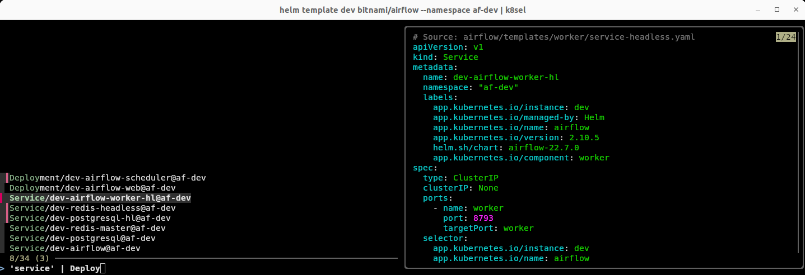

# k8sel

Bash/zsh function to interactively filter and inspect k8s resources in "multi document" yaml by `kind/name@namespace`,
all thanks to the awsome tools: [fzf](https://github.com/junegunn/fzf) and [yq](https://github.com/mikefarah/yq)

Example
```
> helm template dev bitnami/airflow --namespace af-dev | k8sel
```



## Install

1. Make sure you already have
   * [fzf](https://github.com/junegunn/fzf) (only tested with version 0.55.0)
   * [yq](https://github.com/mikefarah/yq)  (only tested with v4.44.6)


2. Download and source the [script](k8sel)
   ```
   curl https://raw.githubusercontent.com/jonesalk/k8sel/refs/heads/main/k8sel -o k8sel
   source k8sel

   ```
   (you likely want to update your ~/.zshrc or ~/.bashrc file with 'source <path_to_k8sel>')

3. Try it out with the sample yaml
   ```
   curl https://raw.githubusercontent.com/jonesalk/k8sel/refs/heads/main/sample.yaml | ./k8sel
   ```
   1. start typing to narrow the list with matching entries (i.e. 'dns')
   2. use arrow keys to choose which resouce is shown in the preview (shift arrow keys to scroll)
   3. press tab to select one or more resource
   4. press enter to print just the selected resources, or ctrl-c to just exit.

You can ofc pipe the result to other tools. i.e. `kubectl`

Pressing ctrl-space with some selected resources, will instead of printing the resources, update the commandline with the corresponding k8sel command. This allows you to first inspect the yaml, and then finalize your updates. If the initial k8sel input was from stdin, a temporary file is used.

If your are running bash, you need to have perl installed for the commandline updating to work :/


## Usage:

```
Usage: k8sel [[-f] yamlfile] [-r resource ...]

Interactively filter k8s resources from multi document yaml using fzf

Options:
  -f: filename to read from. If not supplied, reads from stdin.
      The -f flag is only needed to end collection of resources, "k8sel test.yaml" is valid
  -r: filter resource by kind/name@namespace - multiple allowed. If supplied, no interactive selection
  -h: show this help

Reads from stdin if no filename provided


```


## Tips

fzf search syntax: https://github.com/junegunn/fzf?tab=readme-ov-file#search-syntax

Using the 'finder':

Key | Action
----|-------
Tab / Shift+Tab |  Select/deselect resource for inclusion in final output
Arrow up/down | Navigate resources list
Enter | Exit and output selected resources as multi document yaml
Esc / CTRL-C| Exit without output
Shift + Arrow up/down | scroll preview window
ctrl-space | Exit and update commandline with k8sel command targeting the selected resources


## Known Issues

The k8s api doesn't return multiple documents, but the resources are wrapped in a `kind: List` which has the resources in the `items` array, which the script doesn't handle atm. As an workaround, convert the list elements to documents using `yq '.items[] | split_doc'` before feeding to k8sel - i.e.

``` 
kubectl get cm --all-namespaces -o yaml | yq '.items[] | split_doc' | k8sel
```

Should probably auto-detect this (PR's are welcome ;)
