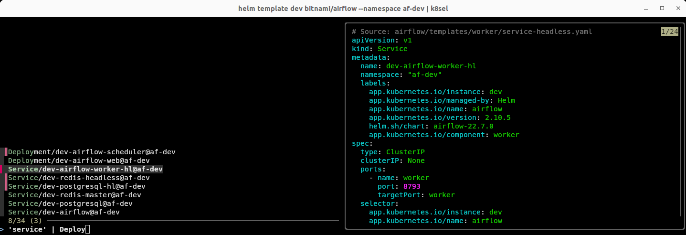

# k8sel

Bash/zsh function to interactively filter and inspect k8s resources in "multi document" yaml by `kind/name@namespace`,
all thanks to the awsome tools: [fzf](https://github.com/junegunn/fzf) and [yq](https://github.com/mikefarah/yq)

Example
```
> helm template dev bitnami/airflow --namespace af-dev | k8sel
```



## Install

1. Make sure you already have
   * [fzf](https://github.com/junegunn/fzf)
   * [yq](https://github.com/mikefarah/yq)

### Option A: Standalone script (bash/zsh, any pipeline)

Download the script to somewhere on your `PATH`:
```
curl https://raw.githubusercontent.com/jonesalk/k8sel/refs/heads/main/k8sel -o ~/.local/bin/k8sel
chmod +x ~/.local/bin/k8sel
```

Try it out:
```
curl https://raw.githubusercontent.com/jonesalk/k8sel/refs/heads/main/sample.yaml | k8sel
```

Works anywhere — scripts, pipelines, any shell:
```
helm template dev bitnami/airflow --namespace af-dev | k8sel | kubectl apply -f -
k8sel my.yaml -r Deployment/foo@default Service/bar@default
```

### Option B: oh-my-zsh plugin (adds Alt-Enter prompt injection)

Clone the repo into your oh-my-zsh custom plugins directory:
```
git clone https://github.com/jonesalk/k8sel ${ZSH_CUSTOM:-~/.oh-my-zsh/custom}/plugins/k8sel
```

Add `k8sel` to the plugins list in `~/.zshrc`:
```
plugins=(... k8sel)
```

The plugin looks for the `k8sel` binary on `PATH` first. If not found, it falls back to the `k8sel` script in the plugin directory itself — so no separate install step is needed when using this option.

Reload your shell:
```
exec zsh
```


## Usage:

```
Usage: k8sel [input.yaml] [-r kind/name@ns ...]

Interactively filter k8s resources from multi document yaml using fzf

Options:
  -r: filter resource by kind/name@namespace - multiple allowed.
      If supplied, outputs matching resources directly (no interactive selection).
  -h: show this help

Reads from stdin if no filename provided.
```


## Tips

fzf search syntax: https://github.com/junegunn/fzf?tab=readme-ov-file#search-syntax

Using the 'finder':

Key | Action
----|-------
Tab / Shift+Tab | Select/deselect resource for inclusion in final output
Arrow up/down | Navigate resources list
Enter | Output selected resources as multi document yaml
Alt+Enter | Put re-runnable `k8sel <file> -r <selections>` onto the prompt (oh-my-zsh plugin only)
Ctrl+F | Open selected resource(s) in less
Esc / Ctrl+C | Exit without output
Shift+Arrow up/down | Scroll preview window


## Known Issues

None currently.

> **Previously:** The k8s API wraps `kubectl get ... -o yaml` responses in a `kind: List` with resources in `.items[]`. k8sel now auto-detects this and unwraps the list automatically, so the following pattern works directly:
> ```
> kubectl get cm --all-namespaces -o yaml | k8sel
> ```
